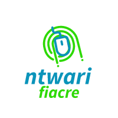

       MY PORTFOLIO

### THIS IS ACTUAL MY FIRST  README AS WELL AS PORTIFOLIO

1.IT's consist of almost six html pages,including:
.index
.education
.field and experiances
.area
.blog
.contact me

2 IT has also css files for clarification it is explained in the table below:

|HTML   |CSS   |JS   |
|---|---|---|
|index|styles|no js|
|education|edu| no js|
|Area|skills|no js|
|field of experiance| boo| no js|
|blog|blo |no js |
|contact me| cont| built in js|

### IF YOU WANT TO CHECK IT YOU CAN

[visit website](https://0122345.github.io/ashimwe/)

